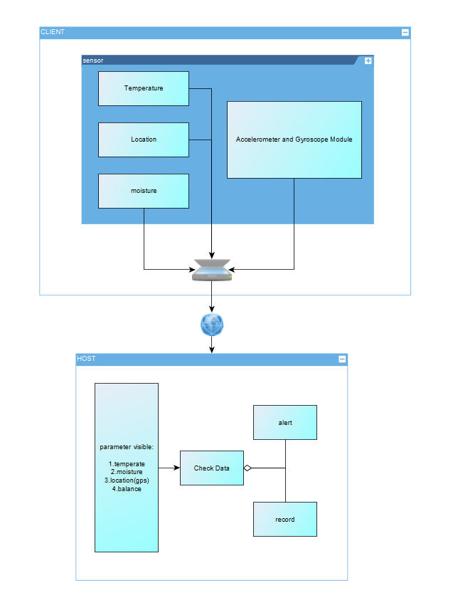
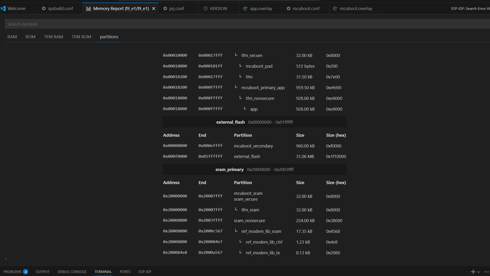
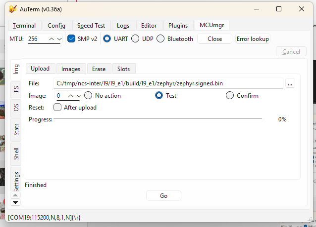
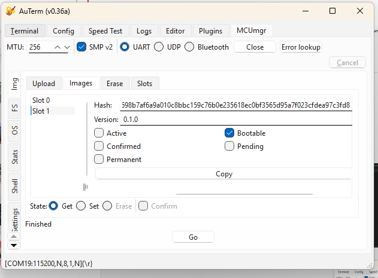
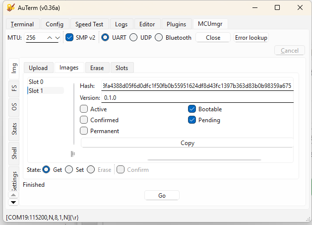
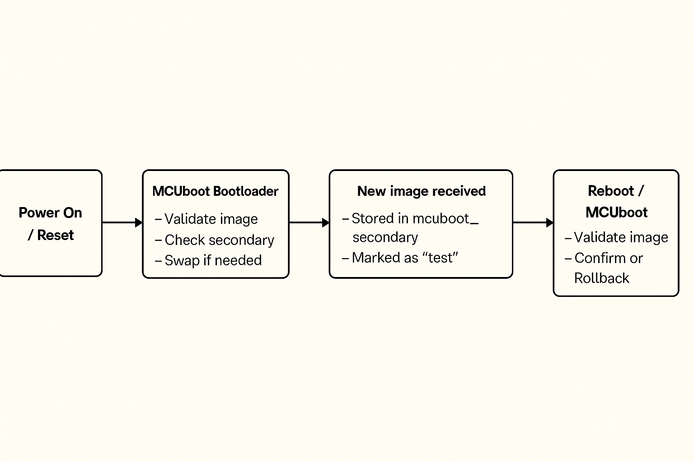
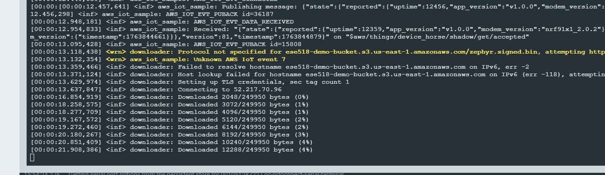
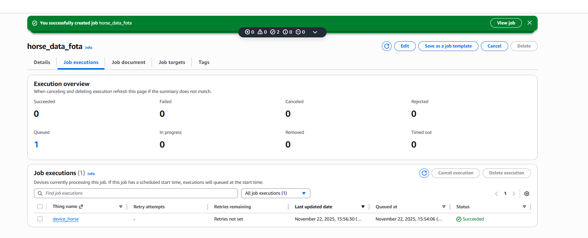
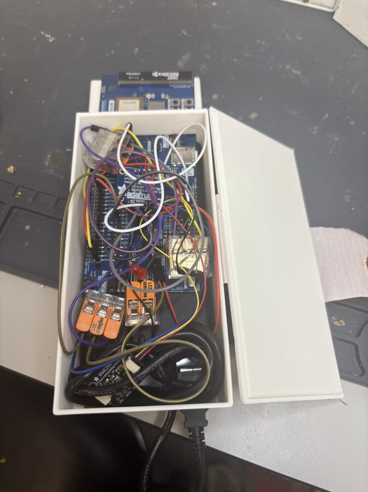

# IoT Venture Pitch

## ESE5180: IoT Wireless, Security, & Scaling

**Team Name: Helldivers**

**Team Number: 3**

| Team Member Name | Email Address           |
| ---------------- | ----------------------- |
| Linhai Deng      | linhaid@seas.upenn.edu  |
| Zhongyu wang     | zhongyuw@seas.upenn.edu |
| Zihao Cai        | zihaocai@seas.upenn.edu |
| Yuhe Zhang       | yz016@seas.upenn.edu    |

**GitHub Repository URL:** https://github.com/ese5180/iot-venture-f25-helldivers.git

## Concept Development

horse

### 3.2.2 Product Function

Our product is a wearable IoT device for horses that integrates GPS tracking, temperature and humidity monitoring, and gait/balance sensing. It helps prevent horses from getting lost, detects early signs of illness by monitoring environmental and physiological conditions, and provides alerts for potential hoof or leg issues. The device enables real-time monitoring for owners, trainers, and veterinarians.

### 3.2.3 Target Market & Demographics

1. Who will be using your product?

- Horse owners, stable managers, trainers, and veterinarians who need live monitoring of their animals’ safety, health, and locomotion.
- Users of livestock monitoring and animal wearable technologies — and those already interested in [pet wearables](https://www.grandviewresearch.com/industry-analysis/pet-wearable-market) — are part of the adjacent user base.
- Equine-focused sports professionals (e.g., horse racing and equestrian teams) will be core users.

2. Who will be purchasing your product?

- Individual horse owners, equestrian clubs, ranches, and breeding farms.
- Veterinary clinics and equine hospitals.
- Professional stables and racecourse facilities.
- Potential B2B customers, such as agricultural tech companies deploying large-scale [livestock monitoring](https://www.grandviewresearch.com/industry-analysis/livestock-monitoring-market) solutions.

3. Where in the world (or space!) would you deploy your product?

- Initial deployment: the United States and Europe, where horse ownership, equestrian culture, and racing industries are already established.
- Expansion markets: Asia (China, Japan, South Korea, India), the Middle East (Saudi Arabia, UAE), and Australia — all regions with strong horse racing and breeding traditions.
- According to [Market Intelo](https://marketintelo.com/report/equine-gps-trackers-market/amp), the equine GPS tracker market is projected to grow significantly worldwide, and [Yahoo Finance](https://finance.yahoo.com/news/equine-healthcare-market-research-forecast-142500533.html) reports strong growth in equine healthcare demand, supporting global adoption potential.

4. How large is the market you’re targeting, in US dollars?

According to [Livestock Monitoring Market](https://www.grandviewresearch.com/industry-analysis/livestock-monitoring-market), the global livestock monitoring market is projected at **USD 5.18 billion in 2024**.
Because our product combines GPS, health/environmental sensing, and gait/balance analytics specifically for horses, we conservatively assume that the equine segment accounts for ~5% of that, giving an addressable market of **USD ~259 million**.

Additionally, the global horse riding equipment market is estimated at **USD 1.60 billion in 2023** ([Horse Riding Equipment Market](https://www.grandviewresearch.com/industry-analysis/horse-riding-equipment-market-report)).Although that number largely covers tack, saddles, and protective gear, it demonstrates that there is already significant spending in the equestrian domain.

5. How much of that market do you expect to capture, in US dollars?

Combining these references, we estimate a TAM between USD 200–400 million for a connected equine monitoring product. If we aim to capture 2–3% in early stages, that corresponds to USD 4–12 million potential revenue.

6. What competitors are already in the space?

- [Nightwatch Smart Halter](https://www.smarthalter.com/?srsltid=AfmBOorbEuz4P-iUAZ0rSBhKH2UQfeXk0QQ2rZYL_pUpbizwPAAS-Ua6) – monitors equine vital signs and stress levels, with automated alerts.
- [Trackener Life](https://www.veterinary-practice.com/article/an-innovative-tracker-for-equines) – provides GPS tracking and behavior monitoring.
- [Equimetrics](https://www.equimetrics.ie/) – combines physiological monitoring with GPS for equestrian performance.
- [Equestic SaddleClip](https://www.equestic.com/product/clip/) – tracks gait and performance metrics for training.

**Differentiator:** None of these competitors combine **GPS tracking, environmental monitoring, and gait/balance detection** in a single integrated system, which is our unique advantage.

### 3.2.4 Stakeholders

## Interview Information

- **Farm name:** Shadow Creek Farm – Ridley Creek
- **Location:** Glen Mills, Pennsylvania, USA
- **Phone:** (484) 301-0560
- **Type:** Horse facility (boarding, show training)
- **Google rating:** 4.7 ★ (71 reviews)

---

## Interview Summary

### How many horses do you have right now, and what do you mainly use them for — racing, training, or just riding?

They currently have about 65 horses at the farm. Most are used for show training and boarding — other people board their own horses there for care.

### How do you usually keep track of where your horses are and check their health — GPS, just watching them, or something else?

They manually count the horses every time. The farm also partners with a nearby clinic to do regular weekly health checks. When asked what daily health factors they pay most attention to, they said the most important is **water intake**, followed by **sleep quality**.

### Have you ever had a horse get lost, hurt, or sick and found out too late? Could you tell me about one time?

Never — it has never happened. They emphasized that horses are very valuable animals, so they are very careful.

### If there was a device that could track your horse’s location, body temperature, humidity, and leg issues in real time, which features would be most useful for you?

They mentioned that in Florida there have been cases of horses being stolen at night and sold illegally for meat. However, they feel such a device may not need to be running 24/7; constant monitoring might not be necessary.

### When picking this kind of device, what matters most to you — price, battery life, comfort for the horse, accuracy, or easy phone access?

Easy access through a phone app is the most important, followed by **battery life**. They also noted that in areas with hurricanes, the device should consider extreme weather conditions.

### Would you want to share this data with vets or trainers? Do you have any privacy concerns about it?

They think privacy and security are very important in rural areas — people generally don’t want to share their personal information or have outsiders know about their property and animals.

### How much would you be willing to pay for something like this? Would you rather pay once or pay a subscription?

It depends on the pricing. They prefer a **monthly subscription at first** to try it out. If the device proves useful, they would like the option to switch to a **lifetime purchase with a discount**. Paying a few hundred dollars upfront for something uncertain would feel too risky.

### 3.2.5 System-Level Diagrams

### 3.2.6 Security Requirements Specification

#### Overview

The system will handle sensitive data about horse location, health, and owner property. Security is critical to ensure data integrity, confidentiality, and protection against tampering.

#### Functionality

SEC 01 – All wireless communication (BLE/Wi-Fi) shall be encrypted using industry-standard protocols (e.g., AES-128 or higher).

SEC 02 – User and animal identifiable data shall not be transmitted or stored in plain text.

SEC 03 – The system shall authenticate devices before accepting data, ignoring messages from unregistered or tampered nodes.

SEC 04 – All sensitive information (keys, credentials) shall be stored in a secure hardware region on the Nordic microcontroller.

### 3.2.7 Hardware Requirements Specification

#### Overview

The device must be lightweight, durable, and capable of continuous operation in outdoor equestrian environments. Hardware components will support real-time sensing, wireless communication, and energy-efficient power management.

#### Functionality

HRS 01 – The system shall be based on a Nordic microcontroller (e.g., nRF52840) to ensure Zephyr RTOS compatibility.

HRS 02 – The hardware shall include GPS, IMU (accelerometer + gyroscope), temperature/humidity sensor, and an optional ToF module for leg movement monitoring.

HRS 03 – The device shall be powered by a rechargeable Li-Po battery with >24 hours continuous operation, with optional solar trickle charging for extended use.

HRS 04 – The enclosure shall be weather-resistant (IP65 or higher), lightweight (<300 g), and safe for equine wear without causing discomfort.

HRS 05 – The hardware should include a IMU that detects the balance of horses, monitoring if they are in sleep.

HRS 06 – The hardware shall provide an interface (e.g., GPIO/ADC) for connecting an external water-intake sensor at the trough to measure and log each horse’s daily water consumption.

### 3.2.8 Software Requirements Specification

#### Overview

The software will collect sensor data (temperature, moisture, GPS, and leg movement from IMU/ToF modules) from wireless nodes attached to the horse, transmit it to the central host, and provide real-time monitoring, alerts, and data logging for horse health and movement analysis.

#### Users

Primary users are horse farm managers, veterinarians, and researchers who need to monitor horse leg movement and health parameters in real time. Secondary users include software developers and system maintainers who will manage the system.

#### Functionality

SRS 01 – Each wireless sensor node (per leg) will measure distance to the ground using a ToF sensor at 25–50 Hz.

SRS 02 – Sensor data (IMU + ToF + temperature + moisture + GPS) will be transmitted wirelessly via BLE/Wi-Fi to the central host.

SRS 03 – The host software will synchronize data from 4 legs and compute relative height differences to determine whether the knees are at the same level.

SRS 04 – The system will generate alerts if any leg shows abnormal vibration amplitude or asymmetry > X mm threshold.

SRS 05 – All data will be logged with timestamps in a database for later analysis.

SRS 06 – The user interface will provide real-time visualization of leg movement and health parameters on a PC dashboard.

### 3.4 Wireless Demo

The demo is uploaded on Github in the File "wireless_demo".

Lihai Deng can pull the repository from GitHub, build, and flash the code to their device.

Zhongyu Wang can pull the repository from GitHub, build, and flash the code to their device.

Yuhe Zhang can pull the repository from GitHub, build, and flash the code to their device.

Zihao Cai can pull the repository from GitHub, build, and flash the code to their device.

Demo video: [Wireless Demo](https://youtu.be/xRVHlD40wJ0)

### 3.5 Secure Firmware Updates

## (3.5.1) Bootloading Process Description

### 1. Bootloader Size

From the memory map:
Partition: mcuboot_primary_app
Address range: 0x00010200 – 0x00017FFF
Size: ~64 KB (0x8000)

The MCUboot bootloader occupies approximately 64 KB of internal flash memory.
It is responsible for validating firmware signatures and managing firmware swapping between slots.

---

### 2. Application Code Size

From the same memory report:
Partition: app
Address range: 0x00018000 – 0x000FFFFF
Size: 928 KB

The main application image occupies approximately 928 KB of flash memory.
This includes the Zephyr-based user application and the MCUmgr subsystem used for firmware updates.

---

### 3. Who Handles Firmware Image Download

The firmware image download is handled by the application, not the bootloader.

- MCUboot validates image signatures and performs slot swaps during boot.
- The application uses the MCUmgr subsystem via the SMP (Simple Management Protocol) over UART to receive and write firmware images.

Handled by: Application (MCUmgr over UART)

---

### 4. Wireless Communication Used for Image Download

In this lab setup, firmware images are transferred through:
UART + SMP v2 protocol (Serial DFU)

Wireless method used: UART (Serial DFU)

---

### 5. Why This Communication Method Was Chosen

- UART DFU provides a simple and reliable interface for testing MCUboot and MCUmgr integration.
- It does not require configuring LTE or BLE stacks.
- It allows fast debugging and consistent transfers during development.

Reason for choice: simplicity, reliability, and ease of debugging.

---

### 6. Where the Downloaded Firmware Images Are Stored

The new firmware images are written into the secondary slot before activation.
Partition: mcuboot_secondary
Address range: 0x000E0000 – 0x000EFFFF
Size: 960 KB

Stored in: mcuboot_secondary partition (in external flash)

---

### 7. Features Enabled to Handle Firmware Update Failures

MCUboot implements several mechanisms to protect against faulty or invalid updates.

| Failure Type              | Handling Feature                                                                           |
| ------------------------- | ------------------------------------------------------------------------------------------ |
| Invalid signature         | ECDSA P-256 digital signature verification using the private/public key pair               |
| Faulty but signed code    | Two-step "Test → Confirm" update process (new image only confirmed after successful boot) |
| Corrupted firmware        | SHA-256 hash check ensures data integrity                                                  |
| Interrupted transfer      | Size and CRC validation before marking the image as ready                                  |
| Version mismatch          | Version comparison prevents downgrades                                                     |
| Power failure during swap | Atomic image swapping and rollback support                                                 |

Enabled safety features:

- Digital signature verification (ECDSA P-256)
- SHA-256 integrity checking
- Slot rollback and atomic swap recovery
- Test-before-confirm update process

---

### 8. Summary

| Item                   | Description                                                          |
| ---------------------- | -------------------------------------------------------------------- |
| Bootloader size        | ~64 KB                                                               |
| Application size       | ~928 KB                                                              |
| Who downloads firmware | Application (MCUmgr subsystem)                                       |
| Communication method   | UART (Serial DFU using SMP v2)                                       |
| Reason for method      | Simple, reliable, and easy to debug                                  |
| Image storage          | mcuboot_secondary partition (external flash)                         |
| Failure recovery       | Signature verification, hash check, rollback, confirm-test mechanism |

---

### 9. Bootloading Process Overview

1. Device powers on and runs MCUboot.
2. MCUboot checks the primary slot for a valid, signed image.
3. If a new image is found in the secondary slot, MCUboot verifies it and swaps it into the primary slot.
4. MCUboot boots the main application.
5. The application runs normally and can use MCUmgr to download new firmware images.
6. When a new image is received, it is written to the secondary slot and marked as "test."
7. On reboot, MCUboot validates and boots the test image.
8. If it runs successfully, the application confirms it; otherwise, MCUboot rolls back to the previous version.

---

### 10. Boot Flow Diagram

## (3.5.2) FOTA

Firmware Over-The-Air (FOTA) was implemented using **AWS IoT Jobs + Amazon S3** to support remote firmware updates for the device.

The workflow is summarized as follows:

1. **Firmware Preparation**
   - The application firmware is built and signed (e.g., `zephyr.signed.bin`) to ensure integrity and compatibility with MCUboot.
   - The signed firmware image is uploaded to an Amazon S3 bucket.

2. **AWS IoT Job Creation**
   - A custom AWS IoT Job (e.g., `horse_data_fota`) is created and associated with the target Thing (`device_horse`).
   - The job document contains the firmware download URL, version, and size.
   - Once created, the job is queued and waits for the device to connect.

3. **Device-Side Job Handling**
   - The device subscribes to AWS IoT Jobs MQTT topics and polls for pending jobs.
   - Upon receiving a FOTA job, the device parses the job document and extracts the S3 firmware URL.

4. **Firmware Download and Update**
   - The device downloads the firmware over HTTPS directly from S3.
   - Download progress is logged and handled in chunks.
   - After the download completes, the firmware is written to the secondary flash slot.

5. **Reboot and Verification**
   - The device reboots after marking the image as ready.
   - MCUboot verifies the firmware signature and performs the image swap.
   - If verification succeeds, the new firmware is executed.

The AWS IoT Console confirms successful job execution, as shown in the screenshots below, where the job status transitions to **Succeeded** for the target device.

Although FOTA was successfully demonstrated using AWS infrastructure, it was excluded from the final deployment due to unresolved cellular reliability issues.

## 3.6 Concept Refinement

## IoT Venture BOM and Cost Model

https://docs.google.com/spreadsheets/d/1zmwnLL9aSm3jkdN8P-3BPP1QO4xDeBbsMbr3Et-MiHA/edit?gid=2020998309#gid=2020998309

## 3.10 Fleet Management

All the code is in file 'aws_iot'.

1) OTA firmware updates with version info

To demonstrate OTA firmware updates, I used the nRF91 AWS IoT FOTA flow.
Initially the device was running firmware version 0.0.1+bc143e and reported this app_version field in its AWS IoT device shadow. I then uploaded a new signed image zephyr.signed.bin to my S3 bucket ese518-demo-bucket and created an AWS IoT job called horse_data_fota targeting the thing device_horse. In the serial log the device receives the job document and the Zephyr downloader starts fetching the file from S3, showing messages like “Connecting to 52.217.70.96” and “Downloaded xxxx/249950 bytes (…%)”. After the download and verification complete, the device reboots into the new firmware. The updated firmware reports a new version string in the shadow, so we can see remotely that the OTA update succeeded and which firmware version is currently installed on the device.

2) Core dump

To demonstrate core dump collection, I integrated the Memfault SDK in the nRF91 firmware and enabled coredump storage and upload. I then intentionally triggered a crash using the Memfault test fault, so that the device saves a coredump to flash. On the next boot, the Memfault SDK detects the stored coredump and uploads it to Memfault’s cloud. In the Memfault web dashboard, under Issues, I can see entries such as “Mem Fault at Unknown Location” and “Assert at Unknown Location” for my firmware versions, each with one or more traces. These issues confirm that the device successfully captured the crash state and forwarded the core dump to Memfault for remote debugging.

3) Forward at least one piece of critical device information to Memfault’s cloud

In addition to crash reports and core dumps, we forward a critical runtime status from each device to Memfault: the GNSS status. We define a custom Memfault heartbeat metric called gnss_status, where 0 means GNSS off, 1 means searching and 2 means a valid position fix. The firmware updates this metric in the GNSS event callback whenever the modem state changes, and the Memfault SDK includes this field in every heartbeat upload. As a result, in the Memfault dashboard we can see, for each nRF9151 DK, whether the horse clip currently has a GPS fix or is stuck searching under poor sky conditions. For our application, this GNSS lock status is critical device information because it directly determines whether the “find my horse” and geofencing functions are reliable at that moment.

## 3.11 MVP Demo

At least two devices showing the functionality below – We have two nRF9151 DKs connected to our backend. In Memfault’s Devices view both boards appear with their IMEI and current software version (0.0.1+bc143e and 0.0.1+990c81), demonstrating that we can manage a small fleet of devices.

Transmitting key data from the devices to a cloud server – Each device connects to AWS IoT Core and periodically publishes a JSON shadow document containing app_version, uptime, horse balance state, and BME280 environment data (temperature, humidity, pressure). This data can be viewed live in the AWS IoT console.

Demonstrating over-the-air firmware updates with signed images – Firmware is built as a signed MCUboot image (zephyr.signed.bin) and stored in an S3 bucket. We create an AWS IoT Job (for example horse_data_fota) using fw_update_job.json. The device downloads the image, reboots, and reports a new app_version in the shadow and in Memfault’s device list, confirming a successful signed FOTA update.

Showing the use of Git Hooks / CI pipelines to run unit tests – The balance-detection logic has unit tests under tests/balance. A Git pre-commit hook runs west twister -T tests/balance -p qemu_cortex_m3 --inline-logs -v on every commit and aborts the commit if any test fails. This demonstrates using our Git workflow to automatically run unit tests before code is committed.

Leveraging Memfault for managing devices – The firmware integrates the Memfault SDK to capture crashes and coredumps. When we trigger a test fault, the device uploads the trace to Memfault. In the Memfault Issues view we see entries such as “Mem Fault at Unknown Location” and “Assert at Unknown Location” tied to specific firmware versions and devices, allowing remote debugging and fleet-wide visibility.

Demonstrating functionality and integration of peripheral devices – The application reads the BNO055 IMU to compute horse balance states (normal, left/right imbalance, front/hind imbalance) and reads the BME280 for temperature, humidity, and pressure. These values are logged locally and included in the JSON payload sent to AWS IoT, showing that both peripherals are correctly integrated into the system.

## 3.14 Final Report

GitHub Website URL: https://ese5180.github.io/iot-venture-f25-helldivers/

### Design changes made along the way

We adjusted the FreeRTOS task structure and priorities so that GNSS fixes and LTE-M communication did not block sensor sampling.

We tuned sampling intervals and reduced logging to lower I²C traffic and CPU load.

We introduced MOSFET gating on the I²C lines as a pragmatic way to avoid bus lockups when multiple sensors were active, even though we now see this as a stop-gap rather than a final solution.

On the cloud side, we iterated on the data schema and MQTT topics to make it easier to visualize and extend later.

The dashboard layout was simplified over time based on what we actually needed during debugging and demos, which also informed our ideas for a cleaner future UI.

### What parts of project would consider a success

Several parts of the system worked very well.

On the communication side, LTE-M and AWS cloud integration were a clear success. The device could establish a stable cellular link, periodically upload data, and recover from transient network issues. On the cloud side, AWS IoT Core and MQTT topics were set up to receive, store, and process data, giving us a complete end-to-end pipeline from embedded hardware to cloud infrastructure.

On the sensing side, the core pipeline also worked reliably. We were able to read orientation from the BNO055 IMU and temperature / humidity / pressure from the BME280 over I²C, and our balance algorithm can distinguish normal, left/right and front/hind load patterns in real time. FreeRTOS task management kept these sensor tasks, GNSS, and LTE-M communication running concurrently without blocking, and the power-management scheme allowed long-duration operation on battery.

Finally, we built a simple but clear dashboard for visualizing the data. Even though it was not fully deployed publicly, it demonstrated that the data format and cloud back-end were well structured for user-facing applications.

### What parts of project didn’t go well

There were three main areas that did not go as well as planned.

The first was heart-rate sensing. The optical PPG module available to us was low quality—it already struggled on human subjects and is unlikely to work well on a moving horse with hair and thick skin. It also shared the same I²C bus as the BNO055 and BME280, and adding it created bus contention and timing problems. Our temporary workaround was to gate sensors with MOSFETs so only one is connected at a time, but this doesn’t fundamentally fix bandwidth and signal-integrity issues, so we dropped heart-rate from the MVP.

The second issue was the user interface deployment. We had a working HTML-based dashboard, but it was never hosted on a public endpoint in time, so it could only be accessed locally. This was mainly due to time pressure near the end of the semester and the extra setup needed for cloud-hosted front-end services.

Third, system performance was not always ideal under real network conditions. Under weak LTE-M or poor GNSS conditions, data upload latency and GNSS fix times were sometimes longer than expected, because GNSS and communication share processing resources and our configuration was not fully optimized.

### Change development approach given the finite time and money resources

If we repeated the project, we would be more aggressive about de-risking high-uncertainty parts early and staging features more clearly.

For sensing, we would prototype heart-rate options at the very beginning—trying multiple PPG modules and simple ECG / girth-strap concepts on the bench—and only integrate into the main PCB once one sensor gives clean, repeatable signals under motion. In parallel, we would profile worst-case I²C traffic early and design the bus layout and sampling schedule around those measurements instead of discovering contention late.

For the cloud and UI, we would plan an “early vertical slice”: a minimal dashboard deployed to a public endpoint in the first half of the semester, then refine it incrementally. That way we always have a complete end-to-end demo and avoid last-minute front-end deployment issues.

We would also start earlier field-style tests to measure real LTE-M and GNSS behavior, and then tune task priorities, retry intervals, and logging based on measured performance rather than only lab conditions.

### Change system design after this development cycle

The overall architecture would stay mostly the same. LTE-M is a good choice for remote barns and pastures, and AWS IoT provides a scalable, industry-standard back-end. The existing IMU and environmental sensors also match our target use case.

However, we would redesign the sensor front-end and heart-rate path. Instead of relying on MOSFETs to time-share a single I²C bus, we would either:

- give the IMU its own dedicated I²C bus and put the environmental and heart-rate sensors on a second bus, or

- use an I²C multiplexer so each device has a clean, isolated channel.

We would also switch to an equine-appropriate heart-rate sensor, ideally using a different interface (analog front-end, UART, or a separate BLE link) so heart-rate no longer competes for I²C bandwidth. For positioning, a more modular GNSS solution with Assisted-GNSS support would reduce fix times without changing the rest of the architecture.

On the UI side, we would keep the basic dashboard concept but simplify the visualization layer and host it directly in the cloud from the start, matching what end users actually need to see day-to-day.

### Images of final product hardware implementation

### Video demonstrating

https://drive.google.com/file/d/1hPCtE9E95GH7761vfB--U3-8jLXJnr4Y/view?usp=sharing

Source code for all firmware and software is uploaded into this repository(https://github.com/ese5180/iot-venture-f25-helldivers.git).

